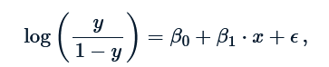
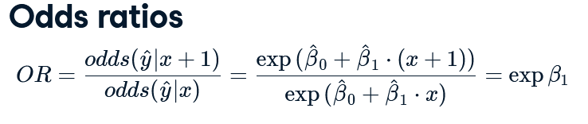
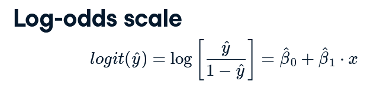
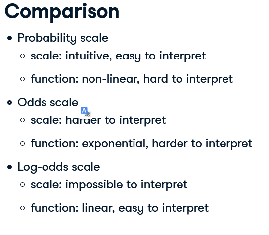

# Statistics

## Logistic Regression

[*Markdown
Tutorial*](https://bookdown.org/yihui/rmarkdown/html-document.html)

```{r setup, include=FALSE}
knitr::opts_chunk$set(fig.align='left', echo=TRUE)
```

```{r,include=FALSE}
library(tidyverse)
library(dplyr)
library(broom)
library(moderndive)
library(knitr)
library(ggplot2)
```

```{r data, include=FALSE}
df_titanic<- read.csv('https://web.stanford.edu/class/archive/cs/cs109/cs109.1166/stuff/titanic.csv') %>%
  mutate(Fare_log=round(log(Fare+0.001)))
```

### Matematyczna interpretacja modelu

Quiz correct answers: d. Hint: `Remember`, the coefficient in a logistic
regression model is the expected increase in the log odds given a one
unit increase in the explanatory variable.

```{r echo=FALSE}
df_titanic %>% select(Survived,Fare,Fare_log) %>% head() %>% kable()
```

Wyliczanie modelu logistycznego.

```{r}
model <- glm(data=df_titanic, Survived ~ Fare_log, family = 'binomial')

tidy(model)  %>% kable(caption='Table 1. Summary statistics for logistic regression model')
```

Model wyliczany jest zgodnie z ponizsza formula
{#id .class width="50%"
height="50%"}

dlategp by otrzymac oszacowania paraemtrow w formie ich wpływu na odds
musimy je poddać działaniu exp()

{.class width="50%" height="50%"}

```{r}
coef(model)

#Tak przemnozone wspolczynniki interpretujemy nastepujaco:
#  o ile % wzrosnie odds wystapienia zdarzenia jezeli wzrosnie nam wartosc predyktora o 1

exp(coef(model))

```

Ponizej w sposob matematyczny pokazuje ze to wlasnie oznacza
interpretacja wzrostu parametra stajacego przy predyktorze.

```{r}

df_aug <- augment(model, type.predict = "response") # without response argument, the fitted value will be on log-odds scale

p3 = df_aug$.fitted[df_aug$Fare_log==3][1]
p2 = df_aug$.fitted[df_aug$Fare_log==2][1]

x <- round(p3/(1-p3)/(p2/(1-p2)),5)

# i sprawdzenie czy dobrze rozumiem zależnosc
x1<-round(exp(coef(model))['Fare_log'],5)
x1==x
```

Prob for Fare_log = 2 was equal to `r p2` while for Fare_log = 3 was
equal to `r p3`. The odds increase by `r x`. The same what model results
suggests -\> `r x1`.

Quiz

The fitted coefficient from the medical school logistic regression model
is 5.45. The exponential of this is 233.73.

Donald's GPA is 2.9, and thus the model predicts that the probability of
him getting into medical school is 3.26%. The odds of Donald getting
into medical school are 0.0337, or---phrased in gambling terms---29.6:1.
If Donald hacks the school's registrar and changes his GPA to 3.9, then
which of the following statements is FALSE:

Possible Answers

a)  His expected odds of getting into medical school improve to 7.8833
    (or about 9:8).
b)  His expected probability of getting into medical school improves to
    88.7%.
c)  His expected log-odds of getting into medical school improve by
    5.45.
d)  His expected probability of getting into medical school improves to
    7.9%.

Correct answers on the top of the page

### Graficzna interpretacja modelu

```{r, collapse = TRUE, echo=FALSE, warning=FALSE}

#While the odds scale is more useful than the probability scale for certain things, it isn't entirely satisfying. Statisticians also think about logistic regression models on the log-odds scale, which is formed by taking the natural log of the odds. 

#The benefit to this approach is clear: now the logistic regression model can be visualized as a line! Unfortunately, understanding what the log of the odds of an event means is very difficult for humans. 

df_aug <- df_aug %>% mutate(odds=(.fitted/(1-.fitted)), log_odds=log(odds))

df_aug %>% 
  ggplot()+
  geom_line(aes(x=Fare_log,y=.fitted), color='green')+
  geom_line(aes(x=Fare_log,y=odds ), color='red')+
  geom_line(aes(x=Fare_log,y=log_odds ), color='blue', label='log_odds')
```

{.class width="50%" height="50%"}

{.class width="50%"
height="50%"}

```{r evaluating model quality}
df_aug %>% mutate(Survived_hat=round(.fitted)) %>%
  select(Survived, Survived_hat) %>% table

#Out of sample predictions
DiCaprio<-data.frame(Fare_log=1)
augment(model, newdata = DiCaprio, type.predict = 'response')

```

## Bayesian Statistics - Introduction

### Introduction

The role of probability distributions in Bayesian data analysis is to
represent uncertainty, and the role of Bayesian inference is to update
these probability distributions to reflect what has been learned from
data.

Let say I want to set an advertisement on social media. They claim, adds
on their surface has 10% of clicks. I a bit sceptical and asses probable
efectivnes may range between 0 and 0.20. I assume that binomial model
will imitate process generating visitors. Binomial model is my
generative model then.

```{r}
n_samples <- 100000
n_ads_shown <- 100
proportion_clicks <- runif(n_samples, min = 0.0, max = 0.2)
n_visitors <- rbinom(n = n_samples, size = n_ads_shown, prob = proportion_clicks)

par(mfrow=c(1,2))
# Visualize proportion clicks
hist(proportion_clicks)
# Visualize n_visitors
hist(n_visitors)
```

Below I present joint distribution over both the underlying proportion
of clicks and how many visitors I would get.

```{r, echo  = FALSE}
prior <- data.frame(proportion_clicks,n_visitors)

  
p<-prior %>% 
  ggplot(aes(x= n_visitors, y= proportion_clicks))+
  geom_point()
library(ggExtra)
ggMarginal(p, type="histogram")

```

I ran my ad campaign, and 13 people clicked and visited your site when
the ad was shown a 100 times. I would now like to use this new
information to update the Bayesian model. The reason that we call it
posterior is because it represents the uncertainty after (that is,
posterior to) having included the information in the data.

```{r}

# Create the posterior data frame
posterior <- prior[prior$n_visitors == 13, ]

# Visualize posterior proportion clicks - below I condition the joint distribution - of prior distribution of proportion_clicks and distribution of n_visitors 
hist(posterior$proportion_clicks)
```

Now we want to use this updated proportion_clicks to predict how many
visitors we would get if we reran the ad campaign.

```{r}
# Assign posterior to a new variable called prior
prior <- posterior

# Take a look at the first rows in prior
head(prior)

# Replace prior$n_visitors with a new sample and visualize the result
n_samples <-  nrow(prior)
n_ads_shown <- 100
prior$n_visitors <- rbinom(n_samples, size = n_ads_shown, prob = prior$proportion_clicks)
hist(prior$n_visitors)
```

### Priors

#### Beta distribution

The Beta distribution is a useful probability distribution when you want
model uncertainty over a parameter bounded between 0 and 1. Here you'll
explore how the two parameters of the Beta distribution determine its
shape.

So the larger the shape parameters are, the more concentrated the beta
distribution becomes.

```{r}
# Explore using the rbeta function
beta_1 <- rbeta(n = 1000000, shape1 = 1, shape2 = 1)
beta_2 <- rbeta(n = 1000000, shape1 = 100, shape2 = 100)
beta_3 <- rbeta(n = 1000000, shape1 = 100, shape2 = 20)
beta_4 <- rbeta(n = 1000000, shape1 = 5, shape2 = 95)


par(mfrow=c(2,2))
hist(beta_1, breaks=seq(0,1,0.02), main = "shape1 = 1, shape2 = 1")
hist(beta_2, breaks=seq(0,1,0.02), main = "shape1 = 100, shape2 = 100")
hist(beta_3, breaks=seq(0,1,0.02), main = "shape1 = 100, shape2 = 20")
hist(beta_4, breaks=seq(0,1,0.02), main = "shape1 = 5, shape2 = 95")
```

The 4th graphs represents the best following setence: *Most ads get
clicked on 5% of the time, but for some ads it is as low as 2% and for
others as high as 8%.*

### Contrasts and comparison

Let say, I initialize also text add campaign, get 6 visitors out of 100
views and now I want to compare which one video or text add is more cost
effective.

```{r}
# Define parameters
n_draws <- 100000
n_ads_shown <- 100
proportion_clicks <- runif(n_draws, min = 0.0, max = 0.2)
n_visitors <- rbinom(n = n_draws, size = n_ads_shown, 
                     prob = proportion_clicks)
prior <- data.frame(proportion_clicks, n_visitors)

# Create the posteriors for video and text ads
posterior_video <- prior[prior$n_visitors == 13, ]
posterior_text <- prior[prior$n_visitors == 6, ]

# Visualize the posteriors
hist(posterior_video$proportion_clicks, xlim = c(0, 0.25))
hist(posterior_text$proportion_clicks, xlim = c(0, 0.25))


posterior <- data.frame(video_prop = posterior_video$proportion_clicks[1:4000],
                        text_prop = posterior_text$proportion_click[1:4000])

# Calculate the posterior difference: video_prop - text_prop
posterior$prop_diff <- posterior$video_prop - posterior$text_prop 

# Visualize prop_diff
hist(posterior$prop_diff)

# Calculate the median of prop_diff
median(posterior$prop_diff)

# Calculate the proportion
mean(posterior$prop_diff > 0.0)


#Different adds have differnt costs then:
visitor_spend <- 2.53
video_cost <- 0.25
text_cost <- 0.05

# Add the column posterior$video_profit
posterior$video_profit <- posterior$video_prop * visitor_spend - video_cost

# Add the column posterior$text_profit
posterior$text_profit <- posterior$text_prop * visitor_spend - text_cost

# Visualize the video_profit and text_profit columns
hist(posterior$video_profit)
hist(posterior$text_profit)

# Add the column posterior$profit_diff
posterior$profit_diff <- posterior$video_profit - posterior$text_profit

# Visualize posterior$profit_diff
hist(posterior$profit_diff)

# Calculate a "best guess" for the difference in profits
median(posterior$profit_diff)

# Calculate the probability that text ads are better than video ads
mean(posterior$profit_diff < 0)

#So it seems that the evidence does not strongly favor neither text nor video ads. But if forced to choose the text ads is better.
```

#### Changeing Generative model

Company has changed the way how they price adds. Now they take money
just for full day of exposition. Binomial model, which approximate
participation of succes in all trials (click in all views) is no longer
valid. For new scenario. **Poison distribution** is now needed.

**The Poison distribution takes only one parameter which is the mean
number of events per time unit**

In R you can simulate from a Poisson distribution using rpois where
lambda is the average number of occurrences:

```{r}
# Change the model according to instructions
n_draws <- 100000
mean_clicks <- runif(n_draws, min = 0, max = 80) #this is my prior
n_visitors <- rpois(n = n_draws, mean_clicks)

prior <- data.frame(mean_clicks, n_visitors)
posterior <- prior[prior$n_visitors == 19, ]

hist(prior$mean_clicks)
hist(posterior$mean_clicks)

```

### Dealing with 2 parameter model

```{r}
#  the temperatures of Sweden water in 21 th of June in few following year
temp <- c(19,23,20,17,23)
# Defining the parameter grid - here are are my priors about the posible values of parameters of distribution
pars <- expand.grid(mu = seq(8,30, by = 0.5), 
                    sigma = seq(0.1, 10, by= 0.3))
# Defining and calculating the prior density for each parameter combination
pars$mu_prior <- dnorm(pars$mu, mean = 18, sd = 5)
pars$sigma_prior <- dunif(pars$sigma, min = 0, max = 10)
pars$prior <- pars$mu_prior * pars$sigma_prior
# Calculating the likelihood for each parameter combination
for(i in 1:nrow(pars)) {
  likelihoods <- dnorm(temp, pars$mu[i], pars$sigma[i])
  pars$likelihood[i] <- prod(likelihoods)
}
# Calculate the probability of each parameter combination
pars$probability <- pars$likelihood * pars$prior
pars$probability <- pars$probability / sum(pars$probability )

library(lattice)
levelplot(probability ~ mu * sigma, data = pars)
```

What's likely the average water temperature for this lake on 20th of
Julys, and what's the probability the water temperature is going to be
18 or more on the next 20th?

Right now the posterior probability distribution is represented as a
data frame with one row per parameter combination with the corresponding
probability.

```{r}
head(pars)
```

But my questions are much easier to answer if the posterior is
represented as a large number of samples, like in earlier chapters. So,
let's draw a sample from this posterior.

```{r}
sample_indices <- sample(1:nrow(pars), size=10000, replace=TRUE, prob=pars$probability)
pars_sample <- pars[sample_indices,c("mu","sigma")]
head(pars_sample)

```

What is probabibility of temperature being 18 or above? Not mean
temperature, the actual temperature.

```{r}
#rnorm is vectorized and implicitly loops over mu and sigma
pred_temp<- rnorm(10000, mean=pars_sample$mu, sd=pars_sample$sigma)

par(mfrow=c(1,2))
hist(pars_sample$mu,30, main = 'probability distribution of mean temperature')
hist(pred_temp,30, main = 'probability distribution of tempeture' )
mean(pred_temp>=18)
```

### Automatisation - BEST package

The Bayesian model behind BEST assumes that the generative model for the
data is a t-distribution; a more flexible distribution than the normal
distribution as it assumes that data points might be outliers to some
degree. This makes BEST's estimate of the mean difference robust to
outliers in the data.

The t-distribution is just like the normal distribution, a generative
model with a mean and a standard deviation that generates heap shaped
data. The difference is that the t-distribution has an extra parameter,
sometimes called the degrees-of-freedom parameter, that governs how
likely the t-distribution is to generate outliers far from its center.

Another way in which BEST is different is that BEST uses a so-called
Markov chain Monte Carlo method to fit the model. Markov chain Monte
Carlo, or MCMC for short, returns a table of samples from the posterior,
we can work with the output just like before.

```{r}

# The IQ of zombies on a regular diet and a brain based diet.
iq_brains <- c(44, 52, 42, 66, 53, 42, 55, 57, 56, 51)
iq_regular <- c(55, 44, 34, 18, 51, 40, 40, 49, 48, 46)

# Calculate the mean difference in IQ between the two groups
mean(iq_brains) - mean(iq_regular)

# Fit the BEST model to the data from both groups
library(BEST)
library(rjags)
best_posterior <- BESTmcmc(iq_brains, iq_regular)

# Plot the model result
plot(best_posterior)

```

Assume that a super smart mutant zombie (IQ = 150) got into the
iq_regular group by mistake. This might mess up the results as you and
your colleagues really were interested in how diet affects normal
zombies.

```{r}
# The IQ of zombies given a regular diet and a brain based diet.
iq_brains <- c(44, 52, 42, 66, 53, 42, 55, 57, 56, 51)
iq_regular <- c(55, 44, 34, 18, 51, 40, 40, 49, 48, 
                150) # <- Mutant zombie

# Modify the data above and calculate the difference in means
mean(iq_brains) - mean(iq_regular)
```

```{r}
# Fit the BEST model to the modified data and plot the result
library(BEST)
best_posterior <- BESTmcmc(iq_brains, iq_regular)
plot(best_posterior)

```

### Conclusions

Bayes allows you to tweak, change and tinker with the model to better
fit the data analytical problem you have. But a last reason to use Bayes
is because it is optimal, kind of. It can be shown, theoretically, that
no other method learns as efficiently from data as Bayesian inference.

In above examples I show what Bayesian model is about: \* I describe my
expectations of proportion_clicks as uniform distribution (prior) \*
Then i describe a generative model which will be responsible for
generating views based on proportion_clicks - the second source of
variability. For this aim I use two diffrent distribution - binomial and
poison - depending on specifity of exercise. \* I was able to say which
add wass better, more, I was able to say which add was better in
probability way.

## Bayesian Statistics - Intermediate

### Likelihood

On the example of poll. Imagine I am taking part in election to local
goverment. Based on many historical election poles I can count on 45% of
votes. Votes chances are approximate by bheta function.

```{r}
df<-data.frame(sample=seq(0,1,0.01),
               density=dbeta(x=seq(0,1,0.01),shape1=45,shape2=55))
df %>% ggplot(aes(x=sample,y=density))+
  geom_line()+
  ggtitle("Density function")

```

Lets imagine that i receive 60% of votes in ellection pole. I can assume
that binomial distribution is well suited for generative model
responsible for how many votes I am geting. Then I may ask myself:
\*\*How probable would be obtaining such a results (60%) of votes under
different succes_rate (paramter of Binomial distribution).

```{R}

df<-data.frame(likelihood=dbinom(x=6,size=10,prob=seq(0,1,0.1)), 
               parameter_p=seq(0,1,0.1))

df %>% ggplot(aes(x=parameter_p,y=likelihood))+
  geom_line()+
  ggtitle("Likelihood distribution over different succes_rate parameters")
```

The likelihood function summarizes the likelihood of observing polling
data X under different values of the underlying support parameter p.
Thus, the likelihood is a function of p that depends upon the observed
data X

### Posterior

Since I've got the prior & likelihood:

-   prior: let say based on the historical pole % of votes I can count
    on is described by betha distribution Betha(45.55) --\> most
    probable is geting 45% votes

-   likelihood: is denoting to the most recent data shown above

I can approach now to modeling **posterior model of p** According to
Bayes rules posterior is calculating by:

*posterior* = prior \* likelihood

However, in more sophisticated model settings, tidy, closed-form
solutions to this formula might not exist. Very loosely speaking, the
goal here is to send information out to the JAGS program, which will
then design an algorithm to sample from the posterior, based on which I
will then simulate the posterior.

#### Compiling rjags model

Built from previous polls & election data, my prior model of is a
Beta(,) with shape parameters a=45 and b=55. For added insight into
**p**, I also polled potential voters. The dependence of X, the number
of these voters that support you, on **p** is modeled by the
Bin(**n**,**p**) distribution.

In the completed poll, X=6 of n=10 voters supported you. The next goal
is to update my model of in light of these observed polling data! To
this end, I will use the rjags package to approximate the posterior
model of . This exercise will be break down into the 3 rjags steps:
define, compile, simulate.

```{r}
library(rjags)

# DEFINE the model
vote_model <- "model{
    # Likelihood model for X
    X ~ dbin(p, n)
    
    # Prior model for p
    p ~ dbeta(a, b)
}"

# COMPILE the model    
vote_jags <- jags.model(textConnection(vote_model), 
    data = list(a = 45, b = 55, X = 6, n = 10),
    inits = list(.RNG.name = "base::Wichmann-Hill", .RNG.seed = 100))

# SIMULATE the posterior
vote_sim <- coda.samples(model = vote_jags, variable.names = c("p"), n.iter = 10000)

# PLOT the posterior
plot(vote_sim, trace = FALSE)
```
